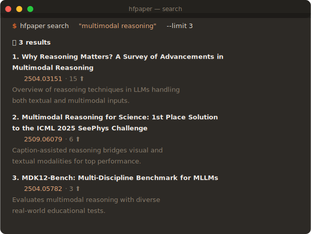
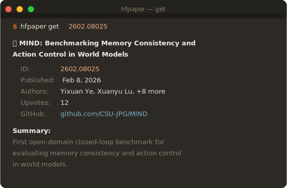
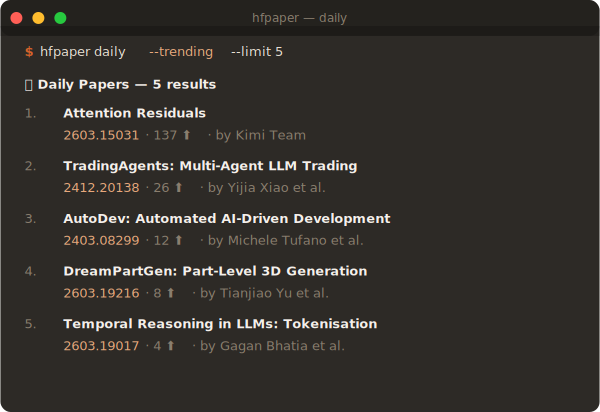
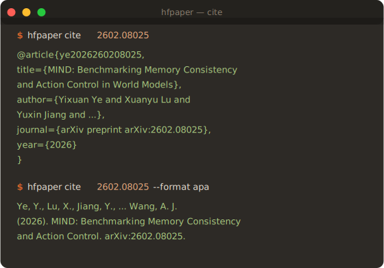
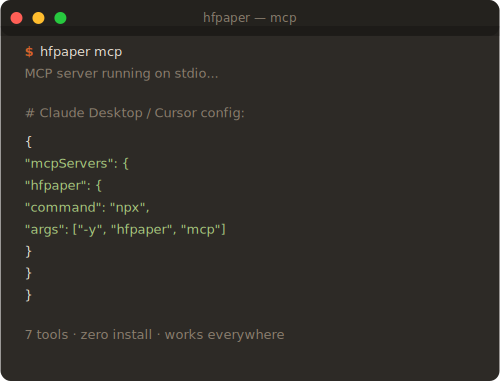

# hfpaper

AI research papers from your terminal. Search, read, cite, and explore the full Hugging Face Papers ecosystem from the command line.

**[hfpaper.zakelfassi.com](https://hfpaper.zakelfassi.com)** · **[npm](https://www.npmjs.com/package/hfpaper)** · **[Releases](https://github.com/zakelfassi/hfpaper/releases)**

## Search

<p align="center">
  
</p>

```bash
hfpaper search "multimodal reasoning" --limit 5
```

Semantic + full-text search across 500K+ papers. Natural language queries work.

## Get Paper Metadata

<p align="center">
  
</p>

```bash
hfpaper get 2602.08025
```

Structured metadata: authors, abstract, AI summary, GitHub repo, upvotes.

## Daily Trending

<p align="center">
  
</p>

```bash
hfpaper daily --trending --limit 10
```

Today's papers, sorted by upvotes. Add `--date 2026-03-22` for a specific day.

## Citations

<p align="center">
  
</p>

```bash
hfpaper cite 2602.08025              # BibTeX (default)
hfpaper cite 2602.08025 --format apa # APA
hfpaper cite 2602.08025 --format mla # MLA
```

## MCP Server

<p align="center">
  
</p>

**Zero-install** — paste into Claude Desktop / Cursor / Windsurf:

```json
{
  "mcpServers": {
    "hfpaper": {
      "command": "npx",
      "args": ["-y", "hfpaper", "mcp"]
    }
  }
}
```

7 tools: `search_papers`, `get_paper`, `read_paper`, `daily_papers`, `paper_models`, `paper_datasets`, `paper_spaces`

## All Commands

```bash
hfpaper search <query> [--limit N]           # Search papers
hfpaper get <paper_id>                        # Paper metadata
hfpaper read <paper_id>                       # Full paper as markdown
hfpaper daily [--trending] [--date] [--limit] # Daily papers feed
hfpaper cite <paper_id> [--format bibtex|apa|mla]  # Generate citation
hfpaper summary <paper_id>                    # AI-generated summary
hfpaper open <paper_id>                       # Open in browser
hfpaper models <paper_id>                     # Linked HF models
hfpaper datasets <paper_id>                   # Linked HF datasets
hfpaper spaces <paper_id>                     # Linked HF Spaces
hfpaper index <paper_id>                      # Index paper (needs HF_TOKEN)
hfpaper mcp                                   # Start MCP server
```

## Install

```bash
npm install -g hfpaper                              # npm
brew install zakelfassi/tap/hfpaper                 # Homebrew
go install github.com/zakelfassi/hfpaper@latest     # Go
```

Or download a binary from [Releases](https://github.com/zakelfassi/hfpaper/releases).

## Output Modes

Auto-detects context:
- **Terminal (TTY)**: rich formatted output with colors and emojis
- **Piped/redirected**: raw JSON for parsing

Override with flags: `--json`, `--table`, `--markdown`

```bash
hfpaper search "RLHF" --json | jq '.[0].paper.title'
hfpaper read 2602.08025 > paper.md
hfpaper read 2602.08025 | llm "summarize in 3 bullets"
```

## Paper ID Formats

Accepts any of these — extracts the arXiv ID automatically:

| Input | Parsed ID |
|-------|-----------|
| `2602.08025` | `2602.08025` |
| `2602.08025v1` | `2602.08025v1` |
| `https://huggingface.co/papers/2602.08025` | `2602.08025` |
| `https://arxiv.org/abs/2602.08025` | `2602.08025` |
| `https://arxiv.org/pdf/2602.08025` | `2602.08025` |

## Use with AI Agents

See [`AGENTS.md`](./AGENTS.md) for drop-in instructions for Claude, Codex, Cursor, and OpenClaw agents.

## License

MIT — see [LICENSE](./LICENSE)

---

Built by [Zak El Fassi](https://github.com/zakelfassi)
